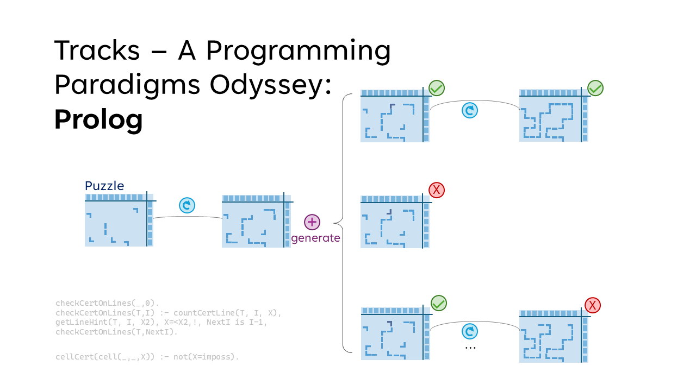
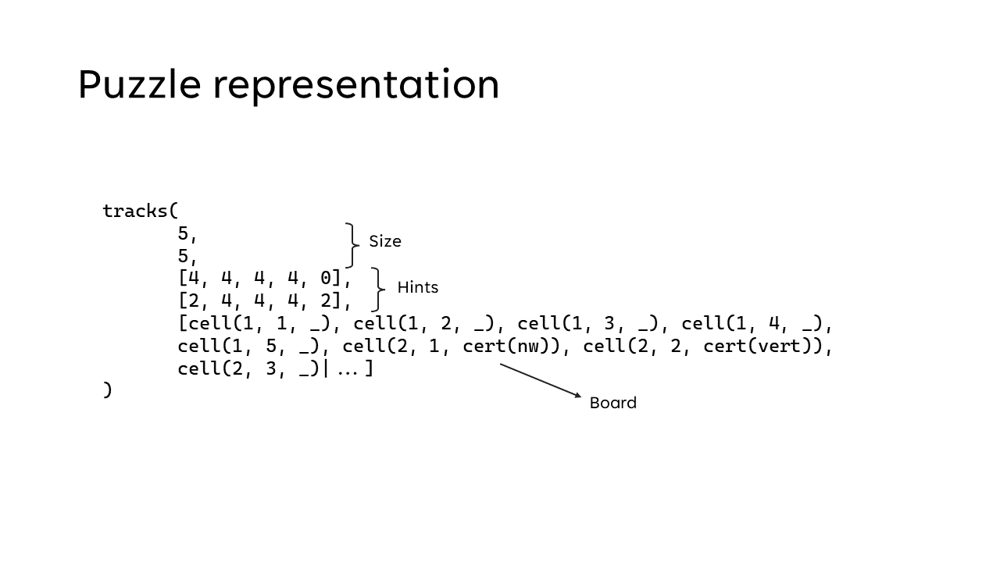
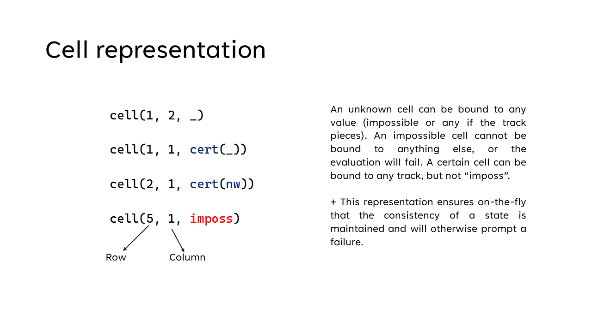
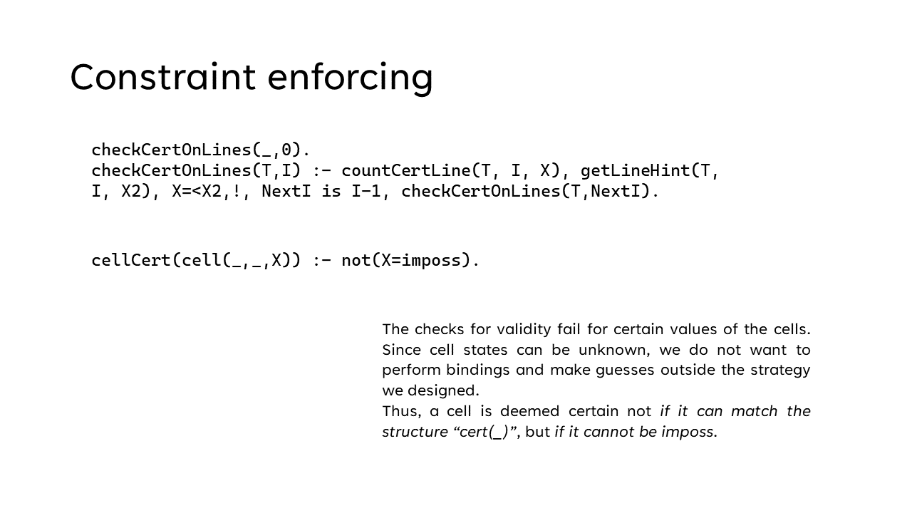
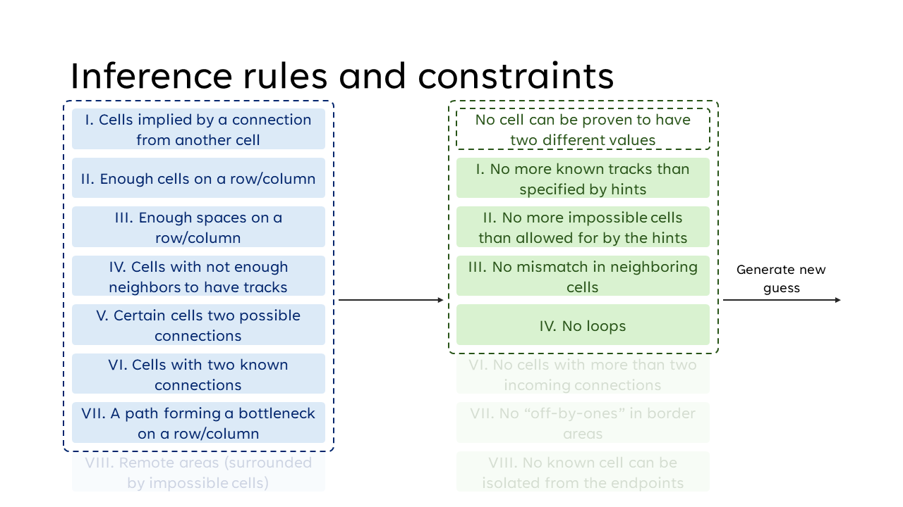

# Tracks Puzzle Solver in Prolog

> This is a part of a series of track solvers implemented in different programming languages for a University semester project on programming paradigms and search strategies.
> See its [Scala counterpart here](https://github.com/vladoleksik/tracks-scala).

## Overview
The project implements a solver for the Tracks puzzle using Prolog. The puzzle consists of a rectangular grid with numerical hints for each row and column, and the goal is to construct a continuous, non-branching rail track connecting predefined endpoints. The solver ingests puzzles from ASCII-formatted files, processes them using a logic-driven approach, and outputs completed solutions in the same format.

The core challenge is the puzzle’s large search space. Prolog’s native backtracking and pattern-matching abilities make it suitable for expressing inference rules and constraints, but performance depends heavily on how well the solver restricts the search space.

## Tracks Puzzle Description

The Tracks puzzle is played on a rectangular grid. Each row and column has a numeric hint indicating how many cells in that line must contain a track segment. The objective is to build a single continuous, non-branching track that connects the puzzle's designated endpoints while satisfying all row and column counts.

- **Grid and hints**: Each row and column provides a number equal to the count of cells in that line that must contain part of the track.
- **Track shape**: Track segments occupy whole cells and join through cell edges. Segments can be straight or corner pieces.
- **Connectivity**: The finished track must be a single continuous path connecting the designated endpoints (no disconnected loops or multiple components).
- **No branching**: Except for the two endpoints (which have one connecting neighbor), every track cell has exactly two track neighbors.
- **Pre-filled / blocked cells**: Some puzzles may include cells that are pre-marked as track; the solver respects these constraints.


This README documents the solver's representation and solving strategy; see the References section for pointers to puzzle collections and Prolog resources.

## References
- [Tracks Puzzle docs by Simon Tatham](https://www.chiark.greenend.org.uk/~sgtatham/puzzles/js/tracks.html)
- [Prolog Documentation](https://www.swi-prolog.org/pldoc/doc_for?object=manual)

## Puzzle Representation

The solver models each puzzle as a structured Prolog term:

```prolog
tracks(W, H, Hc, Hl, C)
```


- **W, H**: Dimensions  
- **Hc, Hl**: Column and row hints  
- **C**: List of cells, each represented by `(row, column, state)`  



Cell states include:
- Unknown
- Impossible
- Certain: straight segments, corners, or generic “must contain track”



This representation supports partial knowledge and prevents contradictory states through Prolog's unification. If a state is logically impossible, the branch fails automatically.

## File Workflow
1. Read number of puzzles.  
2. For each puzzle:
   - Read size, column hints, row hints, and cell states.
   - Convert Unicode input to internal atoms.
   - Handle edge cases such as trailing spaces.
3. After solving, write the output puzzle with identical formatting.


## Core Components

### Counters
Used to evaluate whether a row or column satisfies its numeric hint. They collect relevant cells and count those that meet specific conditions. Efficiency is maintained by avoiding unnecessary variable bindings.

### Getters & Setters
Cells are stored in a single list, so retrieving them requires matching by coordinates. While this is not optimal for random access, performance is mitigated using:
- Cached row/column extraction  
- Neighbor retrieval predicates  

### Solving Strategy
The solver applies a set of inference rules that examine each cell and its neighbors. Rules deduce whether cells must be filled, must be empty, or must take a specific track shape. Examples include:
- Fill a cell if a track segment must continue.
- Mark a cell empty if too few neighbors are possible.
- Apply row/column-level rules once their track count is fully determined.

When inference can no longer deduce new information, the solver makes a controlled guess—choosing a possible state for an uncertain cell—and uses Prolog’s built-in backtracking to explore options.

### Validation
Before solving, the solver rejects boards whose row/column hints are already violated. After solving, it verifies that all hints are satisfied and no invalid configurations (e.g., loops or contradictions) remain.

Double-negation patterns are used to prevent Prolog from binding uninstantiated variables incorrectly, ensuring efficient rule evaluation.



## Correctness and Results
The solver was tested on 101 teacher-provided puzzles:
- **63 solved** within the 1-minute execution target.
- **38 timed out** due to:
  - Slow cell access from the list-based board representation.
  - Large search spaces requiring deeper backtracking.

Additional pruning rules or use of the cut operator could improve performance.

## Architectural Notes
The solver is structured modularly:
- Clean separation of inference rules, constraints, I/O, and validation.
- Minimal side effects; cuts and asserts are used sparingly for optimization.
- New inference rules can be added without major restructuring.

## Reflection
Prolog’s learning curve was steep, but once mastered, it enabled compact logic-based modeling of the Tracks puzzle. Compared to previous implementations, this solver is faster and more flexible, though its performance still depends on effective search-space restriction. Fewer rules were formulated and applied than in the case of the [Scala solver](https://github.com/vladoleksik/tracks-scala), which did affect its performance on larger puzzles.

Future improvements include:
- Adding more targeted inference rules  
- Introducing carefully placed cuts  
- Optimizing cell access and caching  

## Appendix (Summary)



### Example Inference Rules
- **AdjacencyRule**: Uncertain cells adjacent to known tracks become filled.  
- **OnlyTwoGoodNeighboursRule**: A filled cell with two valid neighbors must connect to them.  
- **NoTracksRemainingRule** / **OnlyTracksRemainingRule**: Row/column pruning based on remaining capacity.

### Example Constraints
- **NoLoopsConstraint**: Completed track must be non-looping.  
- **MoreTracksThanPossibleConstraint**: Rejects any axis exceeding its hint.  
- **No contradictions**: Multiple conflicting deductions invalidate a branch.
